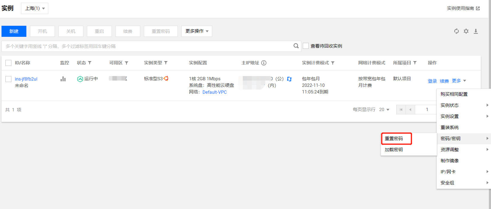

# SSR with docker (科学上网)
> 注：此教程只为技术人员提供，使用过程请遵纪守法，勿作商用，谢谢

## 1. 准备工作
很多同学工作上要用到 google 等工具，但是一般都访问不了，本教程就给大家来讲一下如何科学上网。再次提醒，请遵纪守法

首先得准备一台**国外**，或者**香港**的服务器
这边会提供一个列表供大家选择，点击即可跳转
- 1. [腾讯云服务器](https://cloud.tencent.com/act/cps/redirect?fromSource=gwzcw.3018172.3018172.3018172&redirect=10140&cps_key=1f60ff9e0192ca8340b519ea987139b3&from=activity) 
- 2. [阿里云服务器](https://promotion.aliyun.com/ntms/yunparter/invite.html?userCode=1g8zd89z)

购买的时候 请选择 **Ubuntu** 系统

## 2. 服务器设置
这边默认您已经购买好服务器了，本教程以 [腾讯云](https://cloud.tencent.com/act/cps/redirect?fromSource=gwzcw.3018172.3018172.3018172&redirect=10140&cps_key=1f60ff9e0192ca8340b519ea987139b3&from=activity) 为例。

### 1. 进入[控制台](https://console.cloud.tencent.com/)

### 2. 修改密码

### 3. 登录服务器

### 4. 安装 docker , 输入命令 `sudo apt-get install docker`, 一路 `y` 直到安装成功, 安装成功后 `docker -v` 显示正确版本即为安装成功！

### 5. 关键时刻 
 拉取镜像：`docker pull oddrationale/docker-shadowsocks`,  
  
 起服务：`docker run -d -p 54285:54285 oddrationale/docker-shadowsocks -s 0.0.0.0 -p 54285 -k yourpasswd -m aes-256-cfb`
 

### 6. 检查服务器端口54285是否放开，进入安全组进行设置

### 7. 本地安装运行小飞机ss，安装包请在代码文件 `package` 目录查找

### 安装失败报错解决
有些小伙伴遇到了这样的报错，docker 没有安装成功

根据上面的提示是，让你执行 `sudo snap install docker` 或者 `sudo apt install docker`， 照着执行一条就行，能够 `sudo docker -v` 看到版本号即安装成功。 
又有些小伙伴，在 `sudo snap install docker` 的过程中不小心断网了，导致既没有装成功，重新执行该命令也继续报错，那么这时候，你就应该把进程给 kill 了
怎么[操作](https://blog.csdn.net/u010496966/article/details/95210734)呢？
`snap changes`,
`sudo snap abort X【其中X代表 进程ID】`

----
- 1. [腾讯云服务器](https://cloud.tencent.com/act/cps/redirect?fromSource=gwzcw.3018172.3018172.3018172&redirect=10140&cps_key=1f60ff9e0192ca8340b519ea987139b3&from=activity) 
- 2. [阿里云服务器](https://promotion.aliyun.com/ntms/yunparter/invite.html?userCode=1g8zd89z)